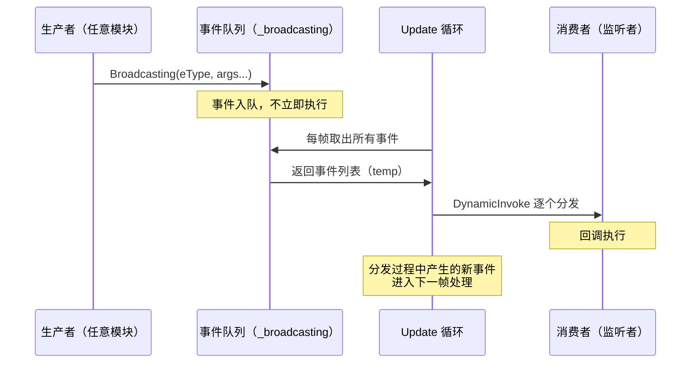
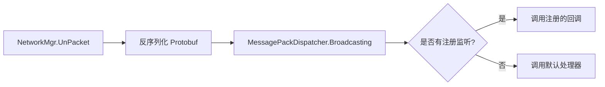
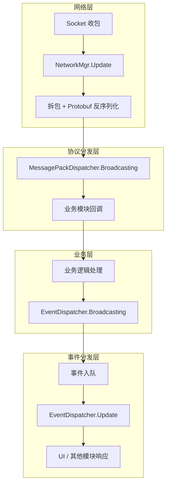

# EventDispatcher 模块文档

## 目录结构

```
Scripts/EventDispatcher/
├── EventDispatcher.cs             # 客户端内部事件分发器（通用事件系统）
└── MessagePackDispatcher.cs       # 网络协议消息分发器（Protobuf 消息分发）
```

---

## 核心架构

### 双分发器设计

```
┌─────────────────────────────────────────────────────────────┐
│                     事件分发系统                              │
├─────────────────────────┬───────────────────────────────────┤
│   EventDispatcher       │   MessagePackDispatcher           │
│   (客户端内部事件)       │   (网络协议消息)                   │
├─────────────────────────┼───────────────────────────────────┤
│ • 场景加载事件           │ • Protobuf 协议消息               │
│ • 网络状态事件           │ • 按 MsgId 分发                   │
│ • 按 eEventType 分发    │ • 支持默认处理器                   │
│ • 延迟到 Update 执行    │ • 即时执行                         │
│ • 支持泛型参数(0~2个)   │ • 固定参数(IMessage)              │
└─────────────────────────┴───────────────────────────────────┘
```

### 类继承关系

```
SingletonBehaviour<T>
└── EventDispatcher          # MonoBehaviour 单例，依赖 Update 驱动

SingletonObject<T>
└── MessagePackDispatcher    # 普通单例，即时分发
```

---

## EventDispatcher（客户端内部事件分发器）

### 事件类型枚举

```csharp
enum eEventType : int {
    AsyncLoaderScene = 0,   // 新场景加载发生，通知相关类清空对象
    SceneLoadStart,         // 场景开始加载
    SceneLoadCompleted,     // 场景加载完成
    Connectting,            // 网络正在连接
    Disconnect,             // 网络断开
    Connected,              // 网络连接成功
}
```

### 工作原理



### 核心特性

| 特性 | 说明 |
|------|------|
| **延迟分发** | 事件不立即执行，缓存到队列中，在 `Update()` 中统一分发 |
| **帧安全** | 分发前复制队列到临时列表，避免迭代中修改集合 |
| **级联安全** | 分发过程中产生的新事件进入下一帧处理，防止无限递归 |
| **类型安全** | 注册/移除时检查委托类型一致性，不匹配则抛出异常 |
| **泛型参数** | 支持 0、1、2 个参数的事件回调 |
| **自动清理** | 移除回调后若无监听者，自动从字典中删除该事件类型 |

### 公开接口

```csharp
// 注册事件监听（支持 0~2 个泛型参数）
void RegisterEvent(eEventType eType, EventCallback handler)
void RegisterEvent<T>(eEventType eType, EventCallback<T> handler)
void RegisterEvent<T, U>(eEventType eType, EventCallback<T, U> handler)

// 移除事件监听
void RemoveEvent(eEventType eType, EventCallback handler)
void RemoveEvent<T>(eEventType eType, EventCallback<T> handler)
void RemoveEvent<T, U>(eEventType eType, EventCallback<T, U> handler)

// 广播事件（入队，下一帧执行）
void Broadcasting(eEventType eType)
void Broadcasting<T>(eEventType eType, T arg1)
void Broadcasting<T, U>(eEventType eType, T arg1, U arg2)
```

### 使用示例

```csharp
// 注册监听
EventDispatcher.GetInstance().RegisterEvent<AppType>(
    eEventType.Connected, OnNetworkConnected);

// 广播事件
EventDispatcher.GetInstance().Broadcasting(eEventType.Connected, AppType.Login);

// 移除监听
EventDispatcher.GetInstance().RemoveEvent<AppType>(
    eEventType.Connected, OnNetworkConnected);
```

---

## MessagePackDispatcher（网络协议消息分发器）

> 📖 该分发器与网络层紧密配合，完整的网络收发包流程和协议注册机制请参阅 [network.md](network.md)。

### 工作原理



### 核心特性

| 特性 | 说明 |
|------|------|
| **即时分发** | 收到消息后立即执行回调，不延迟到下一帧 |
| **按 MsgId 路由** | 以 `int` 类型的协议 ID 作为 key 进行分发 |
| **默认处理器** | 未注册的协议走 `_msgHandlerDefault` 处理 |
| **多播支持** | 同一 MsgId 可注册多个监听者（委托链） |
| **动态注册/移除** | 支持运行时动态添加和移除协议监听 |

### 公开接口

```csharp
// 注册协议监听
void RegisterFollowPacket(int msgId, OnProtocolNoticeDelegate callback)

// 移除协议监听
void RemoveFollowPacket(int msgId, OnProtocolNoticeDelegate callback)

// 注册默认处理器（处理未注册的协议）
void RegisterDefaultHandler(OnProtocolNoticeDelegateEx callback)

// 广播协议消息（由 NetworkMgr 调用）
void Broadcasting(int msgId, Google.Protobuf.IMessage msg)
```

### 委托定义

```csharp
// 标准协议回调（只关心消息体）
delegate void OnProtocolNoticeDelegate(Google.Protobuf.IMessage msg);

// 扩展协议回调（同时获取 msgId 和消息体）
delegate void OnProtocolNoticeDelegateEx(int msgId, Google.Protobuf.IMessage msg);
```

### 使用示例

```csharp
// 注册协议监听
MessagePackDispatcher.GetInstance().RegisterFollowPacket(
    (int)Proto.MsgId.S2CEnterWorld, OnEnterWorld);

// 回调处理
private void OnEnterWorld(Google.Protobuf.IMessage msg) {
    Proto.EnterWorld enterWorld = (Proto.EnterWorld)msg;
    // 处理进入世界逻辑...
}

// 移除监听
MessagePackDispatcher.GetInstance().RemoveFollowPacket(
    (int)Proto.MsgId.S2CEnterWorld, OnEnterWorld);
```

---

## 两个分发器的对比

| 维度 | EventDispatcher | MessagePackDispatcher |
|------|----------------|----------------------|
| **用途** | 客户端内部事件 | 网络协议消息 |
| **基类** | SingletonBehaviour（MonoBehaviour） | SingletonObject（普通类） |
| **分发时机** | 延迟到 Update 帧末 | 即时执行 |
| **Key 类型** | `eEventType` 枚举 | `int`（MsgId） |
| **参数类型** | 泛型（0~2 个任意类型） | 固定（IMessage） |
| **默认处理** | 无（忽略未注册事件） | 有（_msgHandlerDefault） |
| **线程安全** | 主线程（Update 驱动） | 主线程（Update 中调用） |

---

## 完整消息流转



---

## 关键设计特点

1. **职责分离**：网络协议消息和客户端内部事件使用不同的分发器，互不干扰
2. **延迟执行**：EventDispatcher 将事件缓存到队列，在 Update 中统一处理，避免在不安全的时机触发回调
3. **即时响应**：MessagePackDispatcher 收到协议后立即分发，保证网络消息的及时处理
4. **类型检查**：EventDispatcher 在注册/移除时严格校验委托类型，防止类型不匹配导致的运行时错误
5. **自动回收**：两个分发器都在回调为空时自动清理字典条目，避免内存泄漏
6. **解耦设计**：生产者只需广播事件/消息，无需知道谁在监听；消费者只需注册感兴趣的事件，无需知道谁在发送