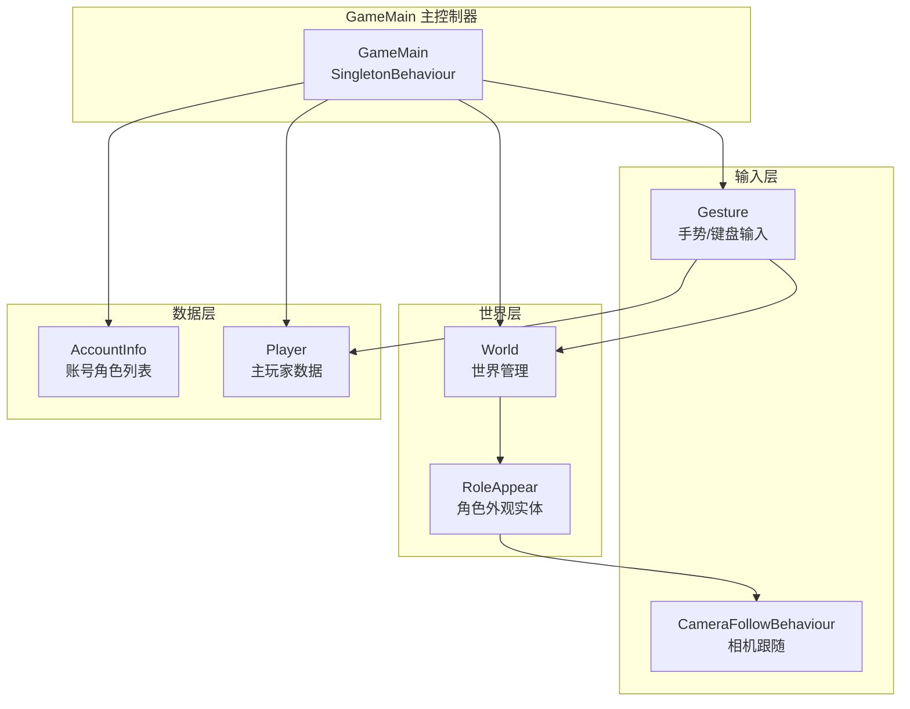
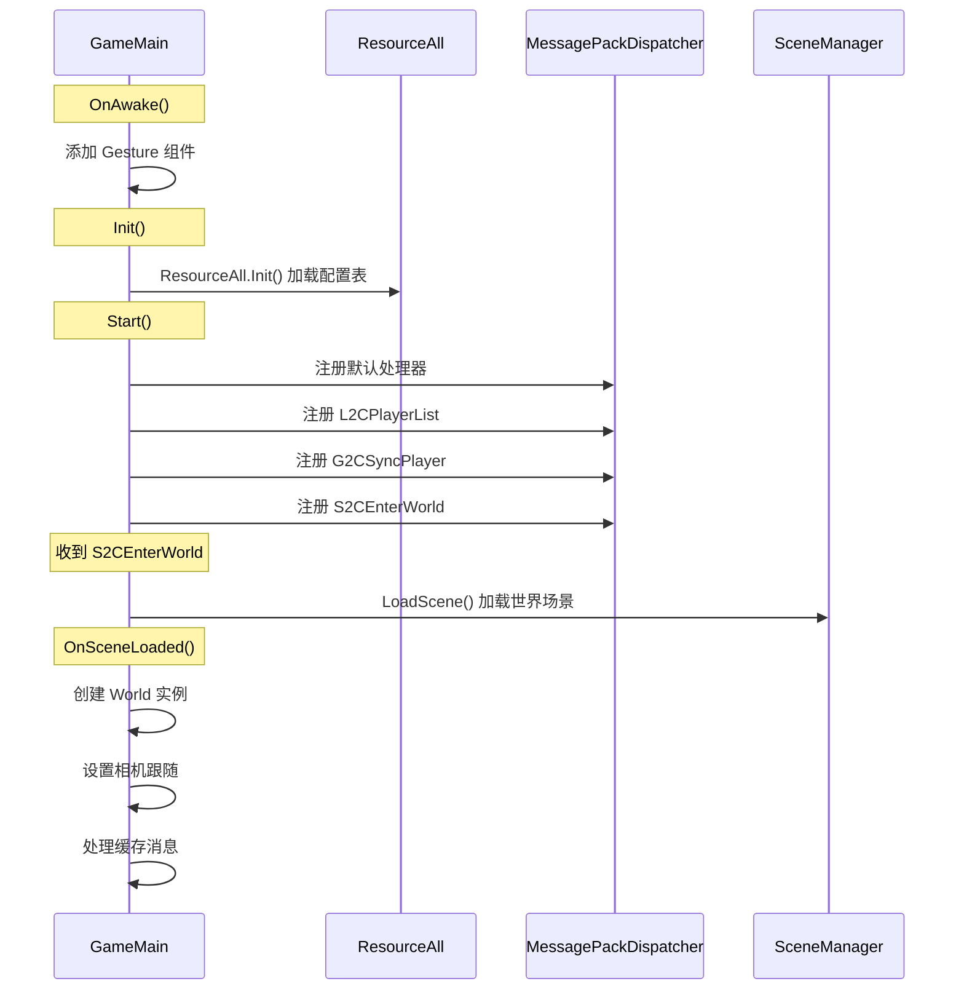
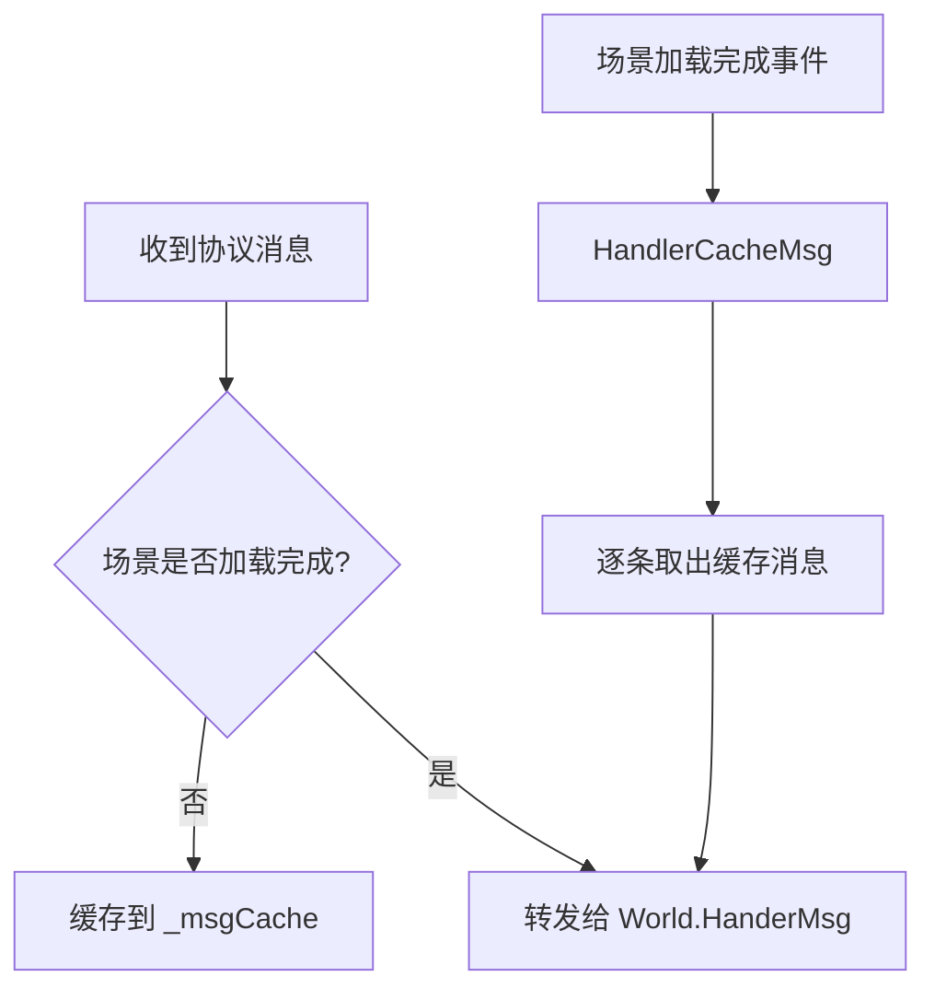
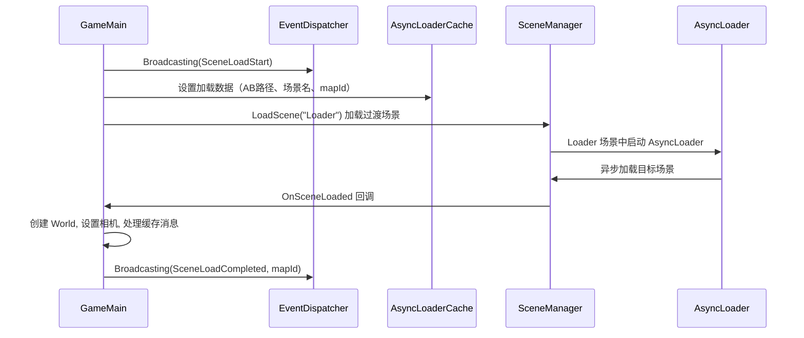
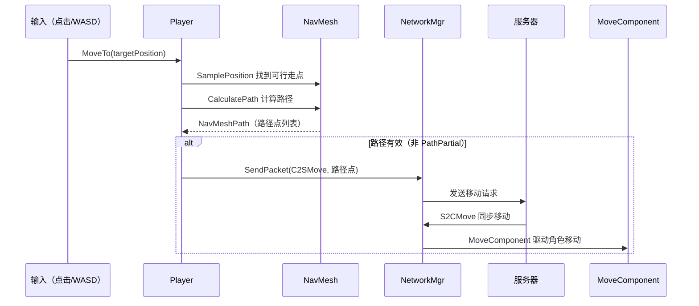
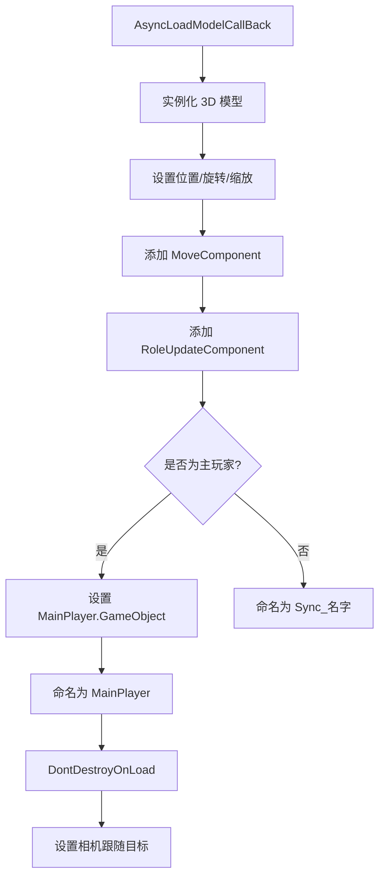
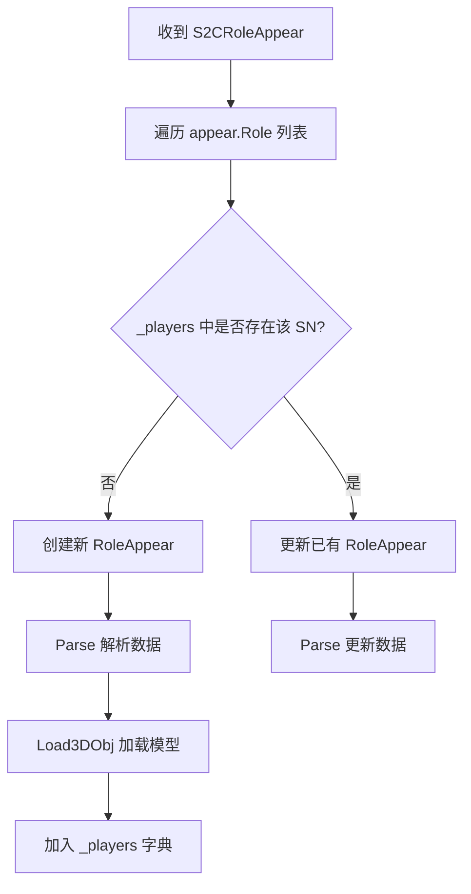
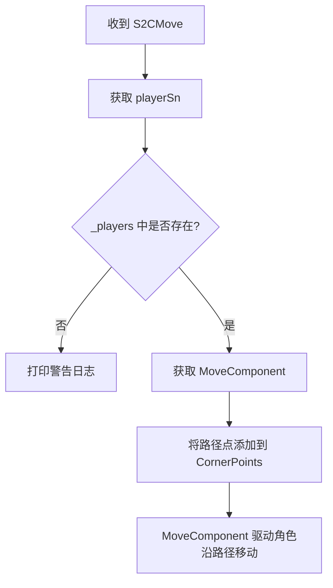
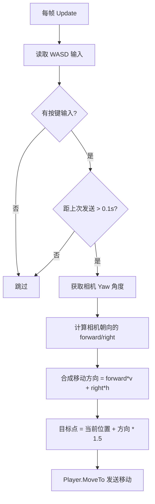
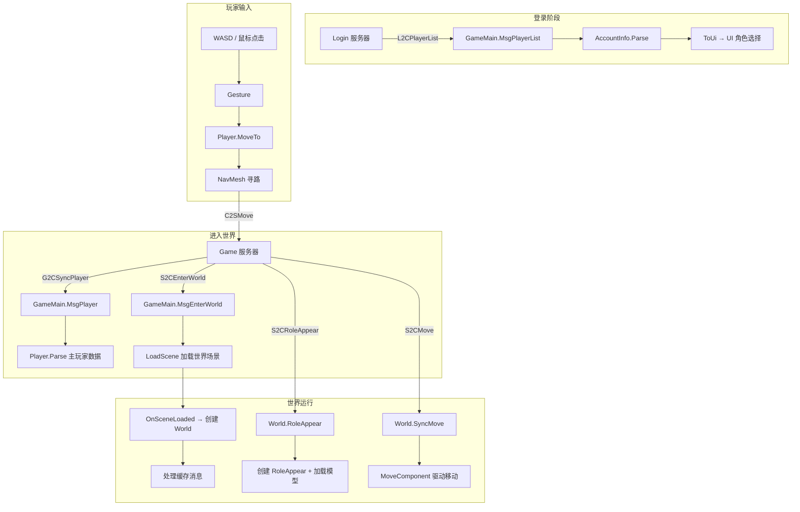

# GameLogic 模块文档

## 目录结构

```
Scripts/GameLogic/
├── GameMain.cs                        # 游戏主控制器（初始化、协议注册、场景加载）
├── Account.cs                         # 账号/角色列表数据管理
├── Camera/
│   └── CameraFollowBehaviour.cs       # 第三人称相机跟随组件
├── Player/
│   ├── Player.cs                      # 主玩家类（移动、NavMesh 寻路）
│   ├── RoleAppear.cs                  # 角色外观实体（3D 模型加载、状态机）
│   └── RoleState/
│       ├── RoleStateType.cs           # 角色状态枚举定义
│       ├── RoleStateStand.cs          # 站立状态
│       └── RoleStateMove.cs           # 移动状态
└── World/
    ├── World.cs                       # 世界管理（角色同步、消息路由）
    └── Gesturel.cs                    # 手势/输入控制（鼠标点击、WASD 移动）
```

---

## 核心架构



### 类关系

```
SingletonBehaviour<T>
└── GameMain                    # 游戏主控制器（MonoBehaviour 单例）

IToUi<T>
└── AccountInfo                 # 账号信息（支持向 UI 推送数据）

StateTemplateMgr<RoleStateType, RoleAppear>
└── RoleAppear                  # 角色外观（状态机管理）

StateTemplate<RoleStateType, RoleAppear>
└── RoleState (abstract)
    ├── RoleStateStand          # 站立状态
    └── RoleStateMove           # 移动状态

MonoBehaviour
├── Gesture                     # 手势输入组件
└── CameraFollowBehaviour       # 相机跟随组件
```

---

## GameMain（游戏主控制器）

### 职责

- 游戏逻辑的总入口，管理全局状态
- 注册和处理核心网络协议
- 管理场景加载流程
- 持有主玩家（`Player`）和当前世界（`World`）引用

### 生命周期



### 协议处理

| 协议 | 处理方法 | 说明 |
|------|----------|------|
| `L2CPlayerList` | `MsgPlayerList` | 登录服务器返回角色列表，解析到 AccountInfo |
| `G2CSyncPlayer` | `MsgPlayer` | 游戏服务器同步主玩家数据 |
| `S2CEnterWorld` | `MsgEnterWorld` | 进入世界，触发场景加载 |
| 其他协议 | `MsgDefaultHandler` | 默认处理器，转发给 World 处理 |

### 消息缓存机制



> 设计目的：场景加载期间收到的协议（如角色出现、移动同步等）不会丢失，加载完成后按顺序处理。

### 场景加载流程



---

## Account（账号数据管理）

### 数据结构

```
AccountInfo
├── _account: string              # 账号名
└── _players: List<PlayerLitter>  # 角色列表
    └── PlayerLitter
        ├── _id: ulong            # 角色 SN
        ├── _name: string         # 角色名
        ├── _gender: Gender       # 性别
        └── _level: int           # 等级
```

### UI 数据推送

`AccountInfo` 继承自 `IToUi<ToUiAccountInfo>`，解析完协议数据后自动调用 `ToUi()` 将数据推送给 UI 层：

```csharp
// 数据流向
Proto.PlayerList → AccountInfo.Parse() → ToUi() → UpdataUiData(ToUiAccountInfo)
                                                         ↓
                                                   UI 层接收更新
```

### ToUi 数据类

| 类名 | 字段 | 说明 |
|------|------|------|
| `ToUiAccountInfo` | Account, Players | 推送给角色选择界面 |
| `ToUiPlayerProperies` | Id, Name, Gender | 单个角色的展示属性 |

---

## Player（主玩家）

### 职责

- 持有主玩家的基础数据（SN、名字、性别）
- 持有 3D GameObject 引用
- 处理移动逻辑（NavMesh 寻路 + 发送移动协议）

### 移动流程



> **关键设计**：客户端不在本地立即移动角色，而是将路径发送给服务器，等服务器同步 `S2CMove` 回来后，由 `MoveComponent` 驱动角色移动。这保证了服务器权威性。

### 核心方法

```csharp
// 设置/获取 3D 对象
void SetGameObject(GameObject obj)
GameObject GetGameObject()

// 解析服务器同步的玩家数据
void Parse(Proto.Player proto)

// NavMesh 寻路找最近可行走点
static Vector3 NavPosition(Vector3 srcPosition)

// 移动到目标点（计算路径 + 发送协议）
void MoveTo(Vector3 hitPosition)
```

---

## RoleAppear（角色外观实体）

### 职责

- 管理场景中所有可见角色（包括主玩家和其他玩家）
- 异步加载 3D 模型
- 管理角色状态机（站立/移动）
- 挂载 `MoveComponent` 和 `RoleUpdateComponent`

### 模型加载

```csharp
// 根据性别加载不同模型
string path = _gender == Gender.Female ? "models/player/02" : "models/player/01";
AssetBundleMgr.GetInstance().AsyncLoad(path, AsyncLoadModelCallBack, null);
```

### 加载完成后的初始化



### 状态机

```
RoleAppear 继承 StateTemplateMgr<RoleStateType, RoleAppear>
│
├── 初始状态: Stand
│
└── 已注册状态:
    ├── RoleStateStand  → 播放 "stand" 动画
    └── RoleStateMove   → 播放 "move" 动画
```

| 状态 | 进入行为 | Update 行为 | 离开行为 |
|------|----------|-------------|----------|
| Stand | 播放 "stand" 动画 | 保持当前状态 | 无 |
| Move | 播放 "move" 动画 | 保持当前状态 | 无 |

> 状态切换由外部（如 `MoveComponent`）通过状态机接口触发。

---

## World（世界管理）

### 职责

- 管理当前世界中的所有角色实体
- 拥有独立的 `MessagePackDispatcher` 处理世界级协议
- 处理角色出现和移动同步

### 数据结构

```csharp
class World {
    ResourceWorld _ref;                              // 地图配置引用
    MessagePackDispatcher _msgDispatcher;             // 世界级消息分发器
    Dictionary<ulong, RoleAppear> _players;           // 所有角色实体（key=SN）
}
```

### 协议处理

| 协议 | 处理方法 | 说明 |
|------|----------|------|
| `S2CRoleAppear` | `RoleAppear()` | 角色出现，创建/更新 RoleAppear 实体 |
| `S2CMove` | `SyncMove()` | 移动同步，将路径点传给 MoveComponent |

### 角色出现流程



### 移动同步流程



---

## Gesture（手势/输入控制）

### 职责

- 处理鼠标点击、双击、滑动等手势操作
- 处理 WASD 键盘移动
- 将输入转化为游戏行为

### 输入状态机

```
eGestureState:
├── None        # 无状态
├── Down        # 鼠标按下
├── Up          # 鼠标抬起
├── HoldDown    # 持续按下
├── SwipeStart  # 滑动开始
└── SwipeEnd    # 滑动结束
```

### 鼠标操作

| 操作 | 判定条件 | 行为 |
|------|----------|------|
| 单击 | 按下→抬起，距离 < 50px | 射线检测，选中角色 |
| 双击 | 两次单击间隔 < 0.2s，距离 < 10px | 预留（暂无逻辑） |
| 滑动 | 按下→抬起，距离 ≥ 50px | 射线检测起止点，取消选中 |

### WASD 移动



**关键参数：**
| 参数 | 值 | 说明 |
|------|-----|------|
| `_moveSendInterval` | 0.1s | 发送移动协议的最小间隔 |
| `_moveStepDistance` | 1.5 | 每次移动的步长距离 |

---

## CameraFollowBehaviour（相机跟随）

### 职责

- 第三人称视角相机跟随玩家
- 鼠标右键拖拽旋转视角
- 鼠标滚轮缩放

### 参数配置

| 参数 | 默认值 | 说明 |
|------|--------|------|
| `Offset` | (0, 4, 8) | 相机相对玩家的偏移 |
| `CameraDistance` | 8 | 相机距离玩家的距离 |
| `_yaw` | 0° | 水平旋转角度 |
| `_pitch` | 35° | 俯仰角度（固定） |
| `MouseRotateSpeed` | 5 | 鼠标旋转灵敏度 |
| `Smooth` | 50 | 滚轮缩放平滑值 |

### 工作原理

```
相机位置 = 玩家位置 - (Quaternion.Euler(pitch, yaw, 0) * Vector3.forward * distance)
相机朝向 = Quaternion.Euler(pitch, yaw, 0)
```

- **水平旋转**：鼠标右键拖拽改变 `_yaw`
- **俯仰角**：固定 35°，不可调节
- **缩放**：鼠标滚轮改变 `fieldOfView`（范围 3~80）
- **无平滑插值**：位置和朝向直接赋值，避免移动/转向时相机晃动

---

## 完整数据流



---

## 关键设计特点

1. **服务器权威移动**：客户端不直接移动角色，而是将路径发送给服务器，等服务器同步回来后才执行移动，保证多人同步一致性
2. **消息缓存机制**：场景加载期间的协议消息被缓存，加载完成后按序处理，避免消息丢失
3. **双层消息分发**：GameMain 注册核心协议，未注册的协议通过默认处理器转发给 World 的独立分发器
4. **状态机驱动动画**：角色使用 `StateTemplateMgr` 状态机管理动画切换，状态与行为解耦
5. **异步模型加载**：通过 AssetBundle 异步加载 3D 模型，加载完成后回调初始化组件
6. **数据-UI 分离**：AccountInfo 通过 `IToUi<T>` 接口将数据转换为 UI 专用结构推送，逻辑层不直接操作 UI
7. **相机视角控制**：基于球坐标系的第三人称相机，支持右键旋转和滚轮缩放，无平滑插值避免晃动
8. **输入频率控制**：WASD 移动限制 0.1s 发送间隔，避免频繁发包