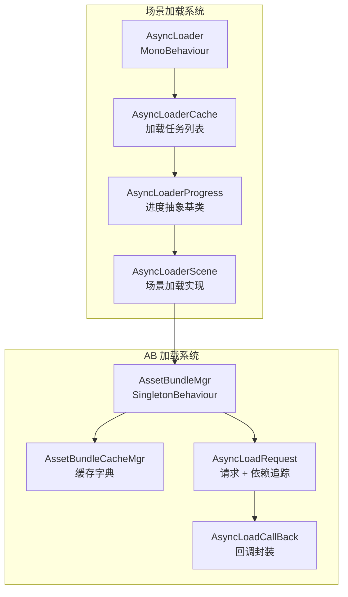
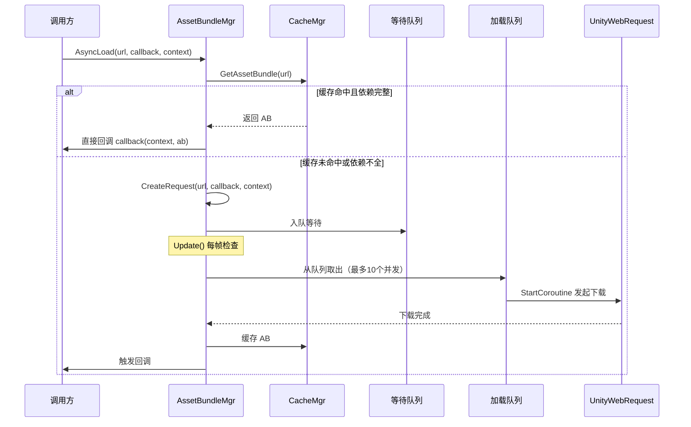
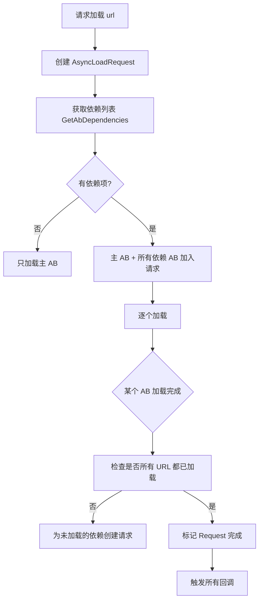
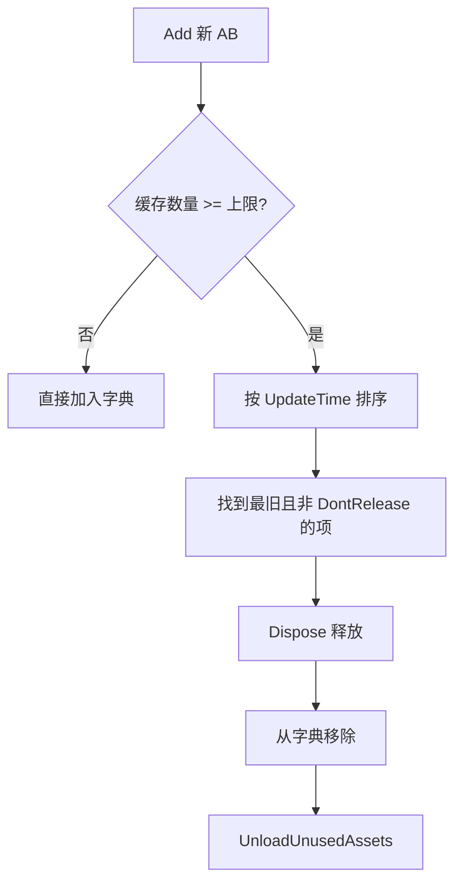
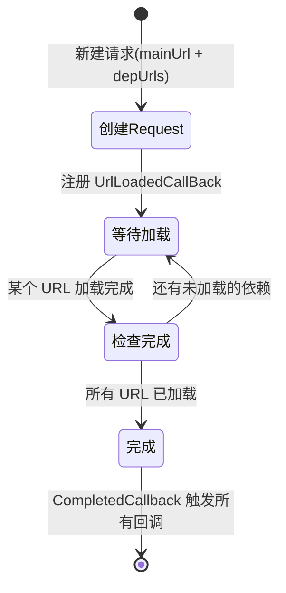
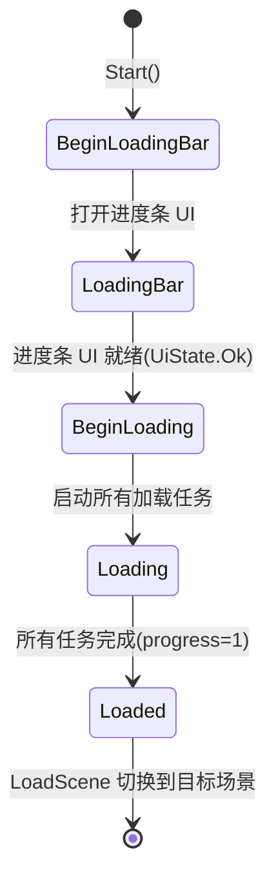
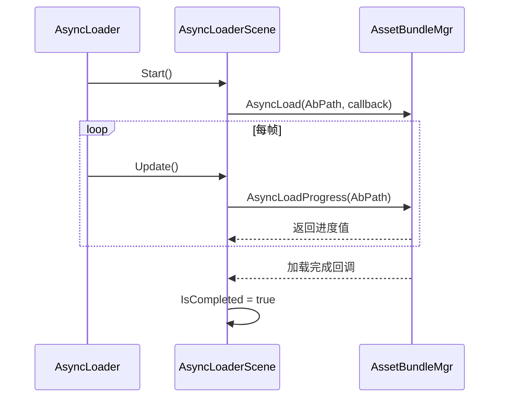
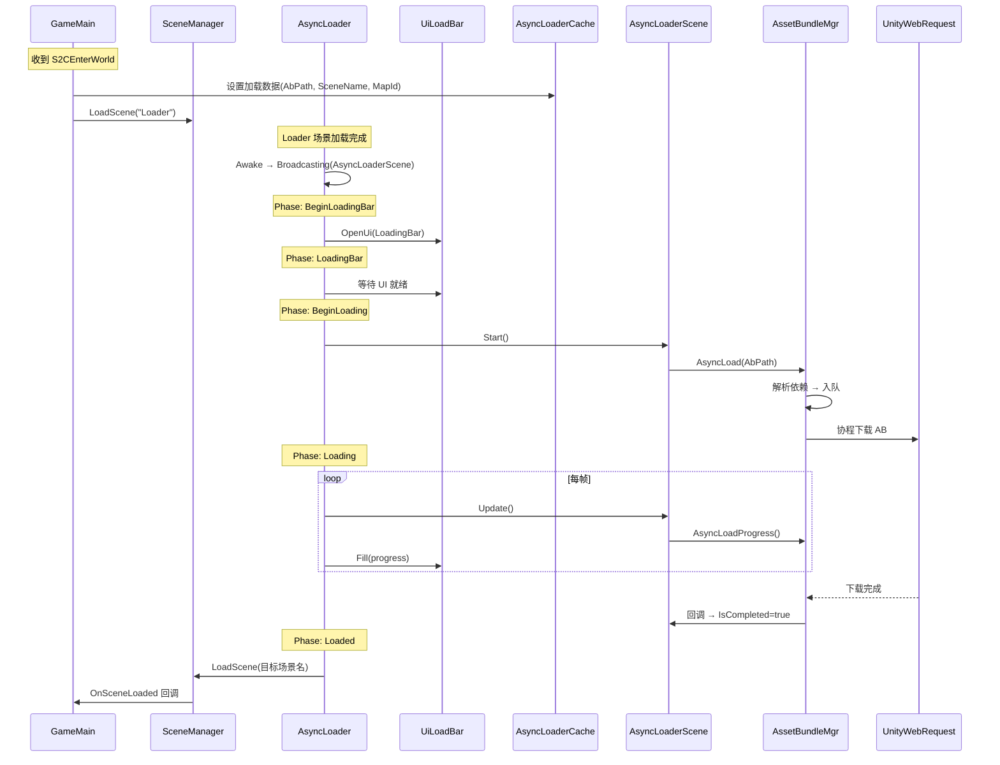

# Loader 模块文档

## 目录结构

```
Scripts/Loader/
├── AB/                                # AssetBundle 加载系统
│   ├── AssetBundleMgr.cs             # AB 管理器（异步加载、队列调度、依赖管理）
│   ├── AssetBundleCache.cs           # AB 缓存管理（LRU 淘汰、不释放标记）
│   └── Request/
│       ├── AsyncLoadCallBack.cs      # 异步加载回调封装
│       └── AsyncLoadRequest.cs       # 异步加载请求（依赖追踪、完成判定）
└── Op/                                # 场景加载操作
    ├── AsyncLoader.cs                # 场景异步加载器（阶段状态机、进度驱动）
    ├── AsyncLoaderCache.cs           # 加载任务缓存（多资源加载列表）
    └── AsyncLoaderProgress.cs        # 加载进度抽象基类 + 场景加载实现
```

---

## 核心架构



### 类关系

```
SingletonBehaviour<T>
└── AssetBundleMgr              # AB 管理器（MonoBehaviour 单例）

SingletonObject<T>
└── AsyncLoaderCache            # 加载任务缓存

MonoBehaviour
└── AsyncLoader                 # 场景异步加载器

IDisposable, IComparable<AssetBundleCache>
└── AssetBundleCache            # 单个 AB 缓存项

AsyncLoaderProgress (abstract)
├── AsyncLoaderTest             # 测试用加载器（模拟 10 秒加载）
└── AsyncLoaderScene            # 场景 AB 加载器
```

---

## AssetBundleMgr（AB 管理器）

### 职责

- 管理所有 AssetBundle 的异步加载
- 维护等待队列和加载队列，控制并发数
- 处理 AB 依赖关系
- 管理 AB 缓存
- 提供加载进度查询

### 加载状态

```csharp
enum LoadStateType : int {
    Start,      // 等待开始加载
    Loding,     // 正在加载中
    Completed,  // 加载完成
}
```

### 核心流程



### 并发控制

```mermaid
graph LR
    subgraph 等待队列 _waitingQueue
        W1[url_1]
        W2[url_2]
        W3[url_3]
        W4[...]
    end

    subgraph 加载队列 _loadingQueue（最多10个）
        L1[LoadingAbInfo_1]
        L2[LoadingAbInfo_2]
        L3[...]
    end

    W1 -->|Update 取出| L1
    L1 -->|完成/失败| C[缓存/重试]
```

**关键参数：**

| 参数 | 值 | 说明 |
|------|-----|------|
| `MaxWorkingCnt` | 10 | 同时下载的最大并发数 |
| `MaxTryNum` | 3 | 单个资源最多重试次数 |

### 依赖管理



依赖解析基于 Unity 的 `AssetBundleManifest`：
- 初始化时先加载主 manifest 文件（`assetbundle.win` / `assetbundle.android`）
- 通过 `manifest.GetAllDependencies(url)` 获取依赖列表
- 主 AB 和所有依赖 AB 全部加载完成后，才触发回调

### 平台扩展名

```csharp
// Windows: .win
// Android: .android
string ext = GetExtension();
```

### 公开接口

```csharp
// 异步加载 AB（自动处理依赖）
void AsyncLoad(string url, AsyncLoadCallBack.CallBack callback, object context)

// 获取已缓存的 AB
AssetBundle GetAb(string url)

// 设置 AB 不释放（常驻内存）
void SetDontRelease(string url)

// 查询加载进度（0~1）
float AsyncLoadProgress(string url)

// 初始化（加载主 manifest）
void Init()

// 是否初始化完成
bool IsInited()

// 为主请求创建依赖加载请求
void CreateDependsReques(string url, string mainUrl)
```

---

## AssetBundleCache（AB 缓存）

### AssetBundleCache（单个缓存项）

| 字段 | 类型 | 说明 |
|------|------|------|
| `_ab` | AssetBundle | AB 资源引用 |
| `_updateTime` | float | 最后使用时间（用于 LRU 淘汰） |
| `_dontRelease` | bool | 是否标记为不释放 |

**特性：**
- 实现 `IDisposable`：释放时调用 `AB.Unload(true)` 卸载所有资源
- 实现 `IComparable`：按 `_updateTime` 排序，支持 LRU 淘汰

### AssetBundleCacheMgr（缓存管理器）



**核心方法：**

```csharp
// 添加 AB 到缓存（超限时 LRU 淘汰）
void Add(string url, AssetBundle ab)

// 获取缓存的 AB
AssetBundleCache GetAssetBundle(string url)

// 卸载所有非 DontRelease 的 AB
void UnLoadAll()
```

---

## AsyncLoadRequest（异步加载请求）

### 职责

- 追踪一个资源及其所有依赖的加载状态
- 维护该资源的所有回调列表
- 当所有 URL（主 + 依赖）加载完成后，触发所有回调

### 工作流程



### 合并请求机制

同一个 URL 在短时间内被多次请求时：
1. 第一次请求：创建 `AsyncLoadRequest`，注册回调，入队下载
2. 后续请求：找到已有的 `AsyncLoadRequest`，仅追加回调
3. 加载完成后：一次性触发所有回调

```csharp
// 同一资源多次请求，只下载一次，回调全部触发
if (_requests.ContainsKey(url)) {
    _requests[url].Callbacks.Add(callbackFun);  // 追加回调
    return;
}
```

---

## AsyncLoadCallBack（回调封装）

简单的回调数据封装类：

```csharp
class AsyncLoadCallBack {
    delegate void CallBack(object context, AssetBundle asset);
    
    CallBack CallBackFun;   // 回调函数
    object Contex;          // 上下文数据
    
    void LoadCompleted(AssetBundle ab);  // 触发回调
}
```

---

## AsyncLoader（场景异步加载器）

### 职责

- 管理场景加载的完整流程
- 分阶段执行：显示进度条 → 加载资源 → 切换场景
- 驱动进度条 UI 更新

### 加载阶段状态机



```csharp
enum AsyncLoaderPhase {
    None,
    BeginLoadingBar,    // 开始加载进度条 UI
    LoadingBar,         // 等待进度条 UI 就绪
    BeginLoading,       // 启动资源加载
    Loading,            // 加载中（更新进度）
    Loaded,             // 加载完成，切换场景
}
```

### 各阶段行为

| 阶段 | 行为 |
|------|------|
| `BeginLoadingBar` | 打开 `UiLoadBar` 进度条界面 |
| `LoadingBar` | 等待进度条 UI 状态变为 `Ok` |
| `BeginLoading` | 遍历 `AsyncLoaderCache.Loaders`，调用每个任务的 `Start()` |
| `Loading` | 每帧计算总进度，更新进度条 UI，检查是否全部完成 |
| `Loaded` | 调用 `SceneManager.LoadScene` 切换到目标场景 |

### 常量定义

```csharp
public const string SceneLoader = "Loader";           // 加载过渡场景名
public const string SceneLoginAbPath = "scenes/login"; // 登录场景 AB 路径
public const string SceneLoginName = "Login";          // 登录场景名
public const int SceneLoginMapId = 1;                  // 登录场景地图 ID
```

---

## AsyncLoaderCache（加载任务缓存）

### 职责

- 存储一次加载操作需要加载的所有资源列表
- 提供场景名和地图 ID 的查询

```csharp
class AsyncLoaderCache : SingletonObject<AsyncLoaderCache> {
    List<AsyncLoaderProgress> Loaders;  // 加载任务列表

    string GetSceneName();  // 获取场景名（从 AsyncLoaderScene 中提取）
    int GetMapId();         // 获取地图 ID
}
```

---

## AsyncLoaderProgress（加载进度）

### 抽象基类

```csharp
abstract class AsyncLoaderProgress {
    string Name;            // 任务名称
    float Progress;         // 当前进度（0~1）
    bool IsCompleted;       // 是否完成

    abstract void Start();  // 启动加载
    abstract void Update(); // 更新进度
}
```

### AsyncLoaderScene（场景加载实现）



| 字段 | 说明 |
|------|------|
| `AbPath` | 场景 AB 包路径 |
| `SceneName` | 场景资源名 |
| `MapId` | 地图 ID |

### AsyncLoaderTest（测试加载器）

模拟 10 秒加载过程，每秒进度 +10%，用于测试进度条 UI。

---

## 完整加载流程



---

## 关键设计特点

1. **异步非阻塞**：所有 AB 加载通过 `UnityWebRequest` + 协程实现，不阻塞主线程
2. **并发控制**：最多同时下载 10 个 AB，超出的排队等待，避免带宽/内存压力
3. **自动重试**：单个资源下载失败最多重试 3 次，超过则放弃并打印错误日志
4. **请求合并**：同一 URL 的多次请求只触发一次下载，完成后统一回调所有请求者
5. **依赖自动解析**：基于 `AssetBundleManifest` 自动解析并加载所有依赖 AB
6. **LRU 缓存淘汰**：缓存超限时按最后使用时间排序，淘汰最旧的非常驻 AB
7. **常驻标记**：`SetDontRelease` 标记的 AB 不会被淘汰（如主 manifest）
8. **阶段状态机**：场景加载分为 5 个阶段，每帧驱动状态流转，确保流程有序
9. **进度聚合**：支持多资源同时加载，总进度 = 各资源进度之和 / 资源总数
10. **平台适配**：通过扩展名（`.win` / `.android`）自动适配不同平台的 AB 文件