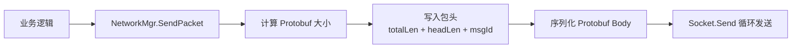
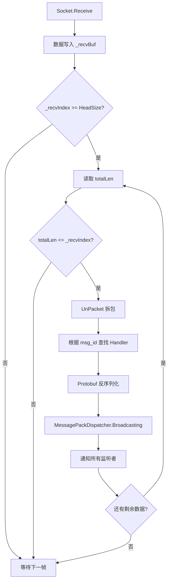
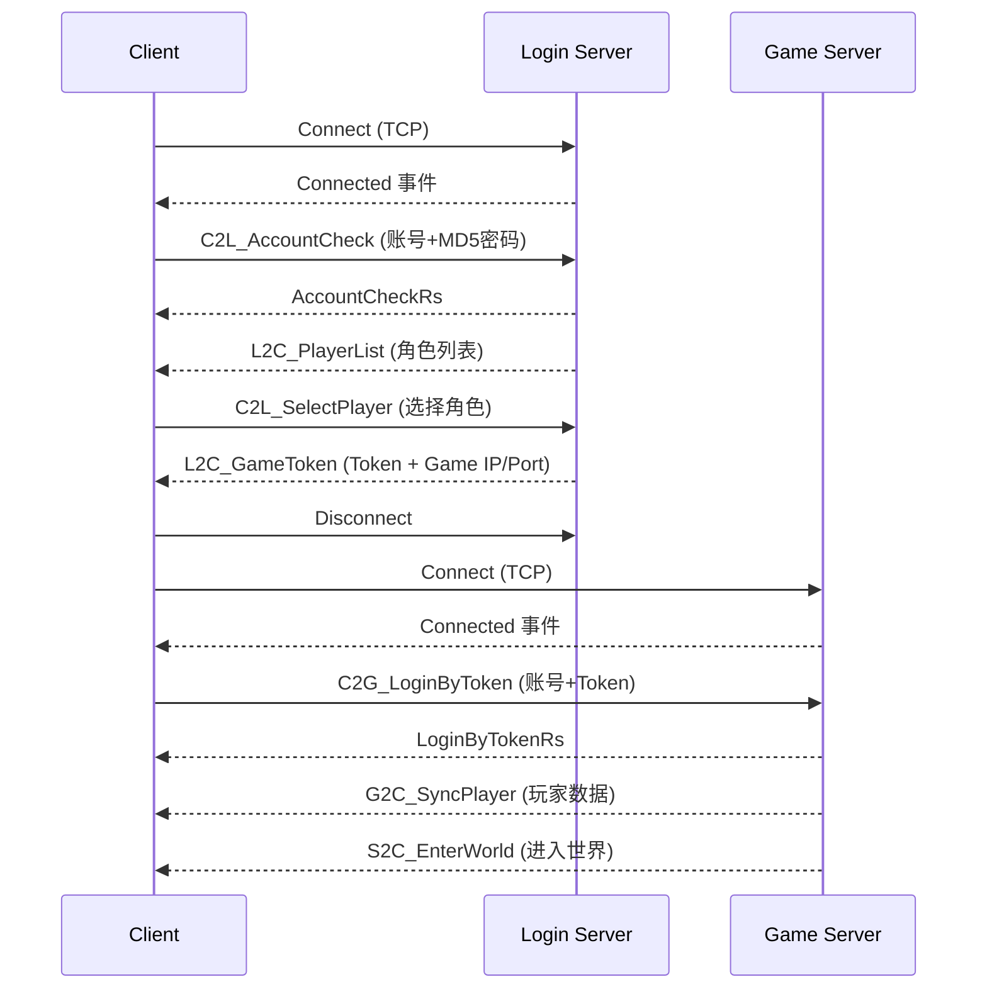

# Network 模块文档

## 目录结构

```
Scripts/Network/
├── Message/                       # Protobuf 生成的协议代码
│   ├── Db.cs                      # 数据库实体定义（Player、Vector3 等）
│   ├── Msg.cs                     # 所有网络消息体定义（自动生成）
│   └── ProtoId.cs                 # 协议 ID 枚举定义（MsgId）
├── NetworkMgr.cs                  # 网络管理器（TCP 连接、收发包、协议注册）
└── Packet.cs                      # 数据包头结构定义
```

---

## 核心架构

### 类关系

```
NetworkMgr (SingletonBehaviour)
├── 管理 Socket 连接（Login / Game 两个服务器）
├── 收包 → 拆包 → 反序列化 → 分发
└── 发包 → 序列化 → 组包 → 发送

MessagePackDispatcher (SingletonObject)
├── 注册协议监听（RegisterFollowPacket）
├── 广播协议消息（Broadcasting）
└── 默认处理器（RegisterDefaultHandler）
```

### 网络状态机

```
ReadyConnect → Connecting → Connected → Disconnected
```

| 状态 | 说明 |
|------|------|
| `ReadyConnect` | 初始状态 |
| `Connecting` | 异步连接中，广播 `eEventType.Connectting` 事件 |
| `Connected` | 连接成功，广播 `eEventType.Connected` 事件，开始收发数据 |
| `Disconnected` | 连接断开，广播 `eEventType.Disconnect` 事件 |

---

## 数据包格式

### 包头结构（PacketHead）

```
┌──────────────┬──────────────┬──────────────┐
│  totalLen    │   headLen    │    msg_id    │
│  (ushort)    │  (ushort)    │  (ushort)    │
│   2 bytes    │   2 bytes    │   2 bytes    │
└──────────────┴──────────────┴──────────────┘
```

- **HeadSize** = 6 字节（totalLen + headLen + msg_id）
- **totalLen**：整个数据包总长度（包头 + 包体）
- **headLen**：包头扩展长度（当前固定为 2）
- **msg_id**：协议 ID，对应 `Proto.MsgId` 枚举

### 完整数据包

```
┌─────────────────────────┬─────────────────────────────┐
│       PacketHead        │      Protobuf Body          │
│       (6 bytes)         │    (totalLen - 6 bytes)     │
└─────────────────────────┴─────────────────────────────┘
```

---

## 协议收发流程

### 发包流程



### 收包流程



---

## 协议分发机制

### 两层分发架构

```
第一层：NetworkMgr（协议解析层）
    RegisterPacket(MsgId, ProcessPacketDelegate)
    → 负责将 byte[] 反序列化为 IMessage 对象

第二层：MessagePackDispatcher（业务分发层）
    RegisterFollowPacket(msgId, callback)
    → 负责将 IMessage 分发给具体的业务逻辑处理
```

### NetworkMgr 注册的协议

| 协议 ID | 消息类型 | 说明 |
|---------|---------|------|
| `C2LAccountCheckRs` | `AccountCheckRs` | 账号验证结果 |
| `C2LCreatePlayerRs` | `CreatePlayerRs` | 创建角色结果 |
| `C2LSelectPlayerRs` | `SelectPlayerRs` | 选择角色结果 |
| `S2CEnterWorld` | `EnterWorld` | 进入世界通知 |
| `L2CGameToken` | `GameToken` | Game 服务器 Token |
| `C2GLoginByTokenRs` | `LoginByTokenRs` | Token 登录结果 |
| `L2CPlayerList` | `PlayerList` | 角色列表 |
| `G2CSyncPlayer` | `SyncPlayer` | 同步玩家数据 |
| `S2CRoleAppear` | `RoleAppear` | 角色出现 |
| `S2CMove` | `Move` | 角色移动同步 |

---

## 心跳机制

- **间隔**：每 5 秒发送一次 Ping（`MsgId.MiPing`）
- **实现**：在 `FixedUpdate()` 中检测时间间隔，发送空包体的 Ping 消息
- **包体**：无（msg 为 null，仅发送包头）

---

## 连接管理

### 双服务器架构

客户端通过 `AppType` 枚举区分两个服务器连接：

| AppType | 说明 |
|---------|------|
| `Login` | 登录服务器（账号验证、角色管理） |
| `Game` | 游戏服务器（游戏逻辑、世界同步） |

### 连接流程



---

## Protobuf 数据结构

### 数据库实体（Db.proto）

| 消息类型 | 字段 | 说明 |
|---------|------|------|
| **Vector3** | x, y, z (float) | 三维坐标 |
| **PlayerBase** | gender (Gender), level (int) | 角色基础属性 |
| **LastWorld** | world_id (int), world_sn (long), position (Vector3) | 上次所在世界信息 |
| **PlayerMisc** | last_world, last_dungeon (LastWorld), online_version (int) | 角色杂项数据 |
| **Player** | sn (ulong), name (string), base (PlayerBase), misc (PlayerMisc) | 完整角色数据 |

### 枚举

| 枚举 | 值 | 说明 |
|------|-----|------|
| **Gender** | none=0, male=1, female=2 | 性别 |

### 主要业务消息（Msg.proto）

#### 登录相关

| 消息 | 字段 | 说明 |
|------|------|------|
| **AccountCheck** | account, password | 账号验证请求 |
| **AccountCheckRs** | return_code (AccountCheckReturnCode) | 账号验证响应 |
| **PlayerLittle** | sn, name, gender, level, last_world, last_dungeon | 角色简要信息 |
| **PlayerList** | account, player[] (PlayerLittle) | 角色列表 |
| **CreatePlayer** | name, gender | 创建角色请求 |
| **CreatePlayerRs** | return_code (CreatePlayerReturnCode) | 创建角色响应 |
| **SelectPlayer** | player_sn | 选择角色请求 |
| **SelectPlayerRs** | return_code (SelectPlayerReturnCode) | 选择角色响应 |

#### Token 相关

| 消息 | 字段 | 说明 |
|------|------|------|
| **GameToken** | return_code, token, ip, port | Game 服务器连接信息 |
| **LoginByToken** | account, token | Token 登录请求 |
| **LoginByTokenRs** | return_code (ReturnCode) | Token 登录响应 |

#### 游戏世界相关

| 消息 | 字段 | 说明 |
|------|------|------|
| **SyncPlayer** | player (Player) | 同步完整玩家数据 |
| **EnterWorld** | world_id, world_sn | 进入世界通知 |
| **Role** | sn, name, gender, level, position (Vector3) | 场景中的角色信息 |
| **RoleAppear** | roles[] (Role) | 角色出现通知 |
| **RoleDisAppear** | sn | 角色消失通知 |
| **Move** | sn, position (Vector3) | 角色移动同步 |

---

## 协议 ID 分段规则

| ID 范围 | 前缀 | 说明 |
|---------|------|------|
| 1~100 | `MI_Network*` | 内部网络事件 |
| 101~104 | `MI_Ping/AppRegister/AppInfoSync` | 内部管理协议 |
| 1000~1024 | `C2L_/L2C_/L2DB_` | 客户端 ↔ Login 服务器 |
| 1100~1118 | `C2G_/G2C_/G2DB_/G2M_/G2S_` | 客户端 ↔ Game 服务器 |
| 1501~1506 | `S2C_/C2S_` | 客户端 ↔ Space 服务器 |
| 2001~2002 | `MI_Broadcast*` | 广播协议 |
| 3001~3002 | `MI_WorldSync*` | 世界同步协议 |
| 4001~4004 | `MI_Account/Player*ToRedis` | Redis 在线状态 |
| 5001~5002 | `MI_Robot*` | 机器人协议 |
| 10000~10501 | `MI_Http*` | HTTP 协议 |
| 20001~20005 | `MI_Cmd*` | 命令行协议 |

---

## NetworkMgr 核心接口

```csharp
// 连接服务器
void Connect(string ip, int port, AppType appType)

// 断开连接
void Disconnect()

// 发送协议
bool SendPacket(Proto.MsgId msgId, Google.Protobuf.IMessage msg)

// 注册协议处理器（内部使用）
void RegisterPacket(Proto.MsgId msgId, ProcessPacketDelegate callback)
```

---

## MessagePackDispatcher 核心接口

```csharp
// 注册协议监听
void RegisterFollowPacket(int msgId, OnProtocolNoticeDelegate callback)

// 移除协议监听
void RemoveFollowPacket(int msgId, OnProtocolNoticeDelegate callback)

// 注册默认处理器（未注册的协议走此处理）
void RegisterDefaultHandler(OnProtocolNoticeDelegateEx callback)

// 广播协议消息
void Broadcasting(int msgId, Google.Protobuf.IMessage msg)
```

---

## 关键设计特点

1. **异步连接**：使用 `Socket.BeginConnect` 异步连接，避免阻塞主线程
2. **非阻塞收包**：连接成功后设置 `socket.Blocking = false`，在 `Update()` 中轮询接收
3. **环形缓冲区**：512KB 接收缓冲区，支持粘包/拆包处理
4. **两层分发**：NetworkMgr 负责反序列化，MessagePackDispatcher 负责业务分发，职责分离
5. **泛型反序列化**：`Process<T>()` 泛型方法统一处理所有 Protobuf 消息的反序列化
6. **双服务器切换**：通过 `AppType` 区分 Login/Game 服务器，支持断开重连切换
7. **心跳保活**：每 5 秒发送 Ping 包，维持 TCP 连接活跃
8. **事件驱动**：连接/断开等状态变化通过 `EventDispatcher` 广播，解耦网络层与业务层