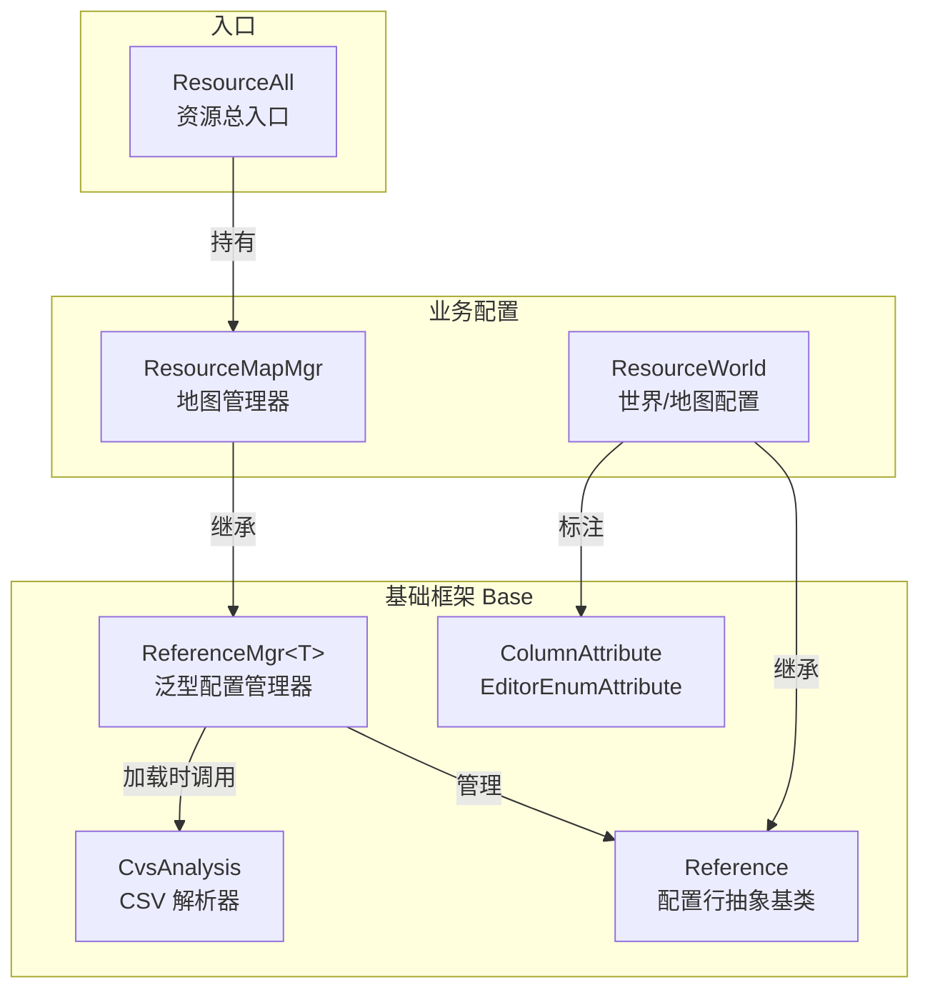
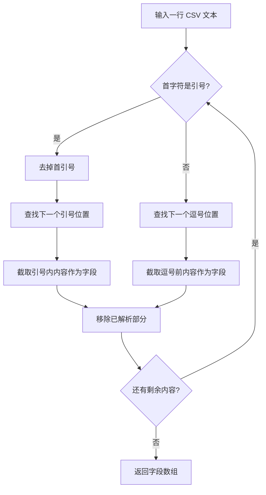
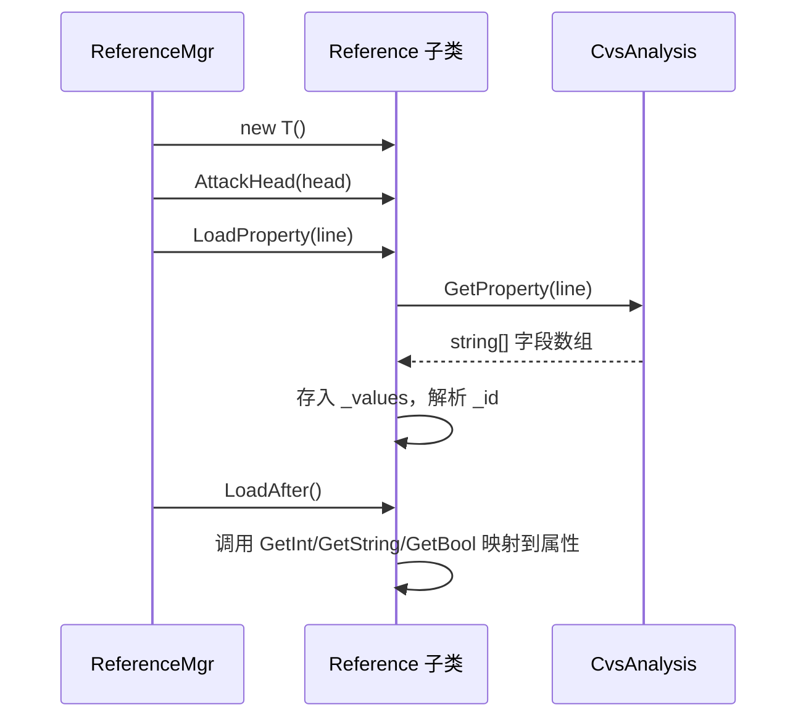
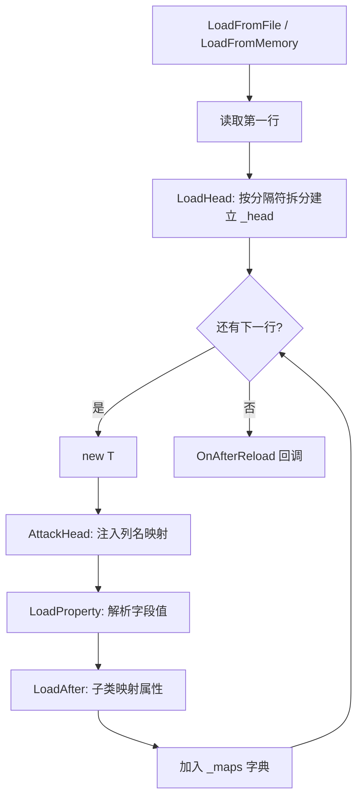
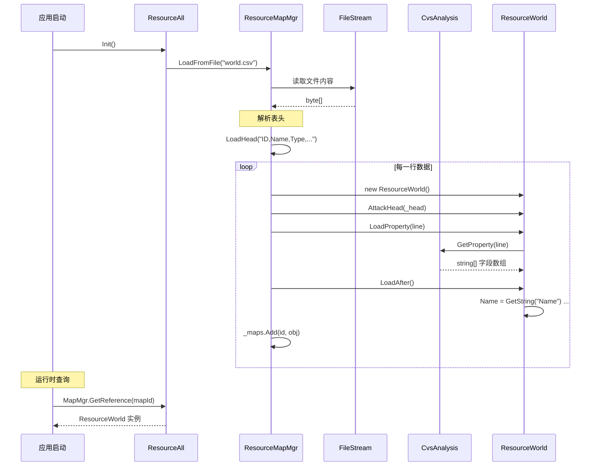

# Resource 模块文档

## 目录结构

```
Scripts/Resource/
├── Base/                              # 资源配置基础框架
│   ├── CvsAnalysis.cs                # CSV 解析器（处理引号和逗号）
│   ├── EditorProperty.cs             # 编辑器属性标注（Column / EditorEnum）
│   ├── Reference.cs                  # 配置行抽象基类（字段读取）
│   └── ReferenceMgr.cs              # 配置管理器（泛型加载 + 字典存储）
├── ResourceAll.cs                    # 资源总入口（初始化所有配置管理器）
└── ResourceWorld.cs                  # 世界/地图配置（场景类型、AB路径等）
```

---

## 核心架构



### 类继承关系

```
SingletonObject<T>
└── CvsAnalysis                 # CSV 解析单例
└── ResourceAll                 # 资源总入口单例

Reference (abstract)
└── ResourceWorld               # 世界/地图配置

IReferenceMgr (abstract)
└── ReferenceMgr<T>             # 泛型配置管理器
    └── ResourceMapMgr          # 地图配置管理器 (ReferenceMgr<ResourceWorld>)
```

---

## CvsAnalysis（CSV 解析器）

### 职责

解析 CSV 格式的配置行，支持带引号的字段（字段内含逗号时用引号包裹）。

### 解析逻辑



### 接口

```csharp
class CvsAnalysis : SingletonObject<CvsAnalysis> {
    // 解析一行 CSV，返回各字段的字符串数组
    string[] GetProperty(string line)
}
```

---

## EditorProperty（编辑器属性标注）

### ColumnAttribute（列属性）

用于标注 `Reference` 子类的属性，提供编辑器元数据：

```csharp
[System.AttributeUsage(System.AttributeTargets.Property)]
public partial class ColumnAttribute : System.Attribute {
    string Comment;      // 列注释（中文名）
    int Width;           // 编辑器中列宽
    string StructType;   // 关联的枚举/结构类型（如 "GEngine.UiType"）
}
```

**使用示例：**
```csharp
[Column("名字", 100)]
public string Name { get; set; }

[Column("类型", 100, "GEngine.ResourceWorldType")]
public int Type { get; set; }
```

### EditorEnumAttribute（枚举标注）

用于标注枚举字段，提供编辑器显示信息：

```csharp
[System.AttributeUsage(System.AttributeTargets.Field)]
public class EditorEnumAttribute : System.Attribute {
    int ID;              // 枚举 ID
    string Name;         // 枚举名称/注释
    string Display;      // 客户端显示的自定义字符串
}
```

**使用示例：**
```csharp
enum ResourceWorldType {
    [EditorEnum("登录")]
    Login = 1,

    [EditorEnum("角色选择")]
    Roles = 2,
}
```

---

## Reference（配置行抽象基类）

### 职责

- 表示 CSV 配置文件中的一行数据
- 提供按列名读取字段值的方法
- 子类通过 `LoadAfter()` 将原始字符串映射到强类型属性

### 核心字段

| 字段 | 类型 | 说明 |
|------|------|------|
| `_values` | `List<string>` | 当前行所有列的原始字符串值 |
| `_head` | `Dictionary<string, int>` | 列名 → 列索引映射（由管理器注入） |
| `_id` | `int` | 行 ID（固定取第一列） |

### 加载流程



### 字段读取方法

```csharp
// 按列名获取布尔值（>=1 为 true）
bool GetBool(string name)

// 按列名获取整数值
int GetInt(string name)

// 按列名获取字符串值
string GetString(string name)
```

> 所有方法内部将列名转为小写后查找，实现大小写不敏感匹配。

---

## ReferenceMgr\<T\>（泛型配置管理器）

### 职责

- 从文件或内存流加载 CSV 配置
- 解析表头（第一行）建立列名映射
- 逐行创建 `Reference` 子类实例并存入字典
- 提供按 ID 查询的接口

### 核心字段

| 字段 | 类型 | 说明 |
|------|------|------|
| `_maps` | `Dictionary<int, T>` | ID → 配置对象字典 |
| `_head` | `Dictionary<string, int>` | 列名 → 列索引映射 |

### 加载流程



### 表头格式

第一行为列名，支持 `\t`、`;`、`,` 三种分隔符：
```
ID,Name,Type,AbPath,ResName,UiResType,Init,PlayerInitPos
```

> 约定：第一列必须为 `ID`。

### 公开接口

```csharp
// 从文件加载
void LoadFromFile(string path)

// 从内存流加载
void LoadFromMemory(MemoryStream ms)

// 按 ID 获取配置对象
T GetReference(int id)

// 获取所有配置对象
List<Reference> GetAll()
```

### 扩展点

```csharp
// 子类可重写，在所有数据加载完成后执行自定义逻辑
protected virtual void OnAfterReload() { }
```

---

## ResourceAll（资源总入口）

### 职责

作为所有配置管理器的统一入口，负责初始化加载。

```csharp
class ResourceAll : SingletonObject<ResourceAll> {
    public ResourceMapMgr MapMgr = new ResourceMapMgr();

    public void Init() {
        MapMgr.LoadFromFile(Path.Combine(Global.GetInstance().GetReferencePath(), "world.csv"));
    }
}
```

### 使用方式

```csharp
// 初始化
ResourceAll.GetInstance().Init();

// 获取地图配置
ResourceWorld map = ResourceAll.GetInstance().MapMgr.GetReference(mapId);
```

---

## ResourceWorld（世界/地图配置）

### 职责

定义世界/地图的配置数据结构，对应 `world.csv` 中的一行。

### 地图类型枚举

```csharp
enum ResourceWorldType {
    Login = 1,      // 登录
    Roles = 2,      // 角色选择场景
    Public = 3,     // 公共地图
    Dungeon = 4,    // 副本地图
}
```

### 配置字段

| 属性 | 类型 | 说明 |
|------|------|------|
| `Id` | int | 地图 ID |
| `Name` | string | 地图名称 |
| `Init` | bool | 是否为初始地图 |
| `Type` | int | 地图类型（ResourceWorldType） |
| `AbPath` | string | AssetBundle 包路径 |
| `ResName` | string | 场景资源名 |
| `UiRes` | int | 初始 UI 类型（UiType） |
| `PlayerInitPos` | string | 玩家初始位置 |

### 辅助方法

```csharp
// 判断是否为角色选择场景
bool IsLobby()
```

### ResourceMapMgr

```csharp
// 地图配置管理器，直接继承泛型管理器，无额外逻辑
class ResourceMapMgr : ReferenceMgr<ResourceWorld> { }
```

---

## 完整数据流



---

## CSV 配置文件格式示例

`world.csv` 文件格式：

```csv
ID,Name,Type,AbPath,ResName,UiResType,Init,PlayerInitPos
1,登录,1,scenes/login,Login,1,1,0;0;0
2,角色选择,2,scenes/lobby,Lobby,2,0,0;0;0
3,新手村,3,scenes/village,Village,0,0,10;0;5
```

---

## 关键设计特点

1. **泛型管理器**：`ReferenceMgr<T>` 通过泛型约束 `where T : Reference, new()` 实现类型安全的配置加载，新增配置类型只需继承 `Reference` 并创建对应管理器
2. **表头驱动**：通过解析 CSV 第一行建立列名映射，字段读取按名称而非索引，增删列不影响已有代码
3. **大小写不敏感**：列名查找统一转小写，避免配置文件大小写不一致导致的问题
4. **引号支持**：`CvsAnalysis` 支持引号包裹的字段，处理字段内含逗号的情况
5. **编辑器集成**：`ColumnAttribute` 和 `EditorEnumAttribute` 为编辑器工具提供元数据（列宽、注释、关联类型），支持可视化编辑
6. **两阶段加载**：`LoadProperty` 解析原始数据 → `LoadAfter` 映射到强类型属性，分离通用逻辑和业务逻辑
7. **单例入口**：`ResourceAll` 作为统一入口管理所有配置管理器，便于初始化和全局访问
8. **扩展友好**：新增配置只需三步 — ①创建 `Reference` 子类 ②创建 `ReferenceMgr<T>` 子类 ③在 `ResourceAll` 中注册