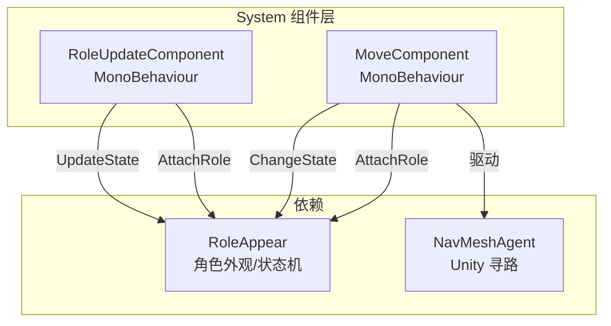
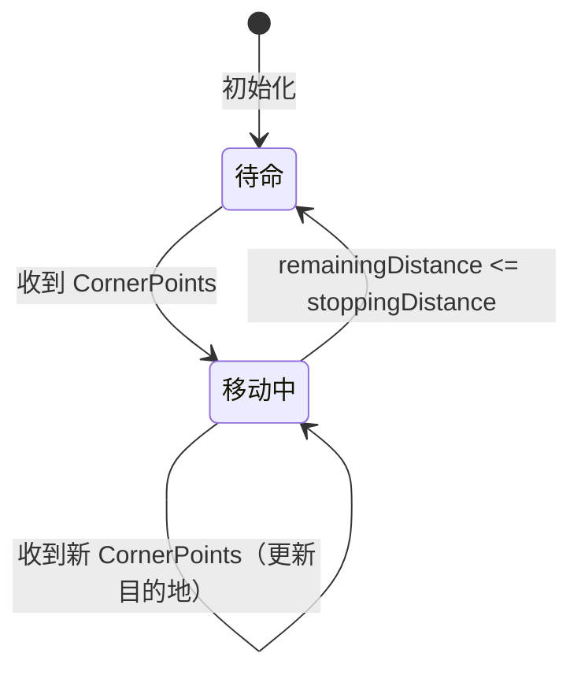
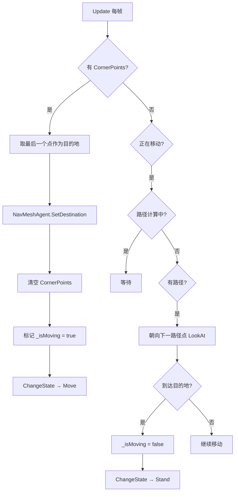
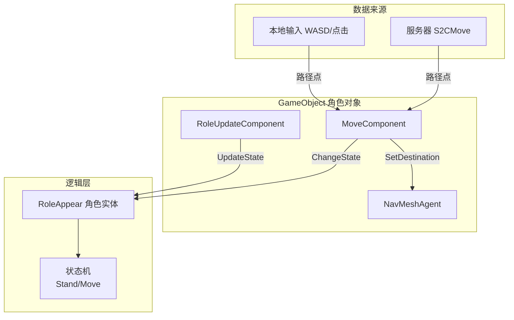
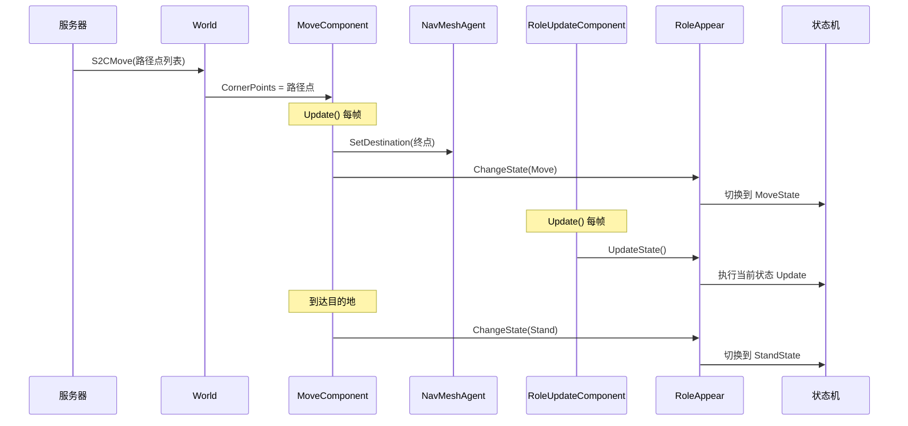

# System 模块文档

## 目录结构

```
Scripts/System/
├── MoveSystem/                        # 移动系统
│   └── MoveComponent.cs              # 移动组件（NavMesh 寻路）
└── UpdateSystem/                      # 更新系统
    └── RoleUpdateComponent.cs        # 角色状态更新组件
```

---

## 核心架构



### 设计思路

采用 **组件式（Component-Based）** 设计，将移动逻辑和状态更新逻辑从角色实体中分离出来，作为独立的 `MonoBehaviour` 组件挂载到 GameObject 上：

- `MoveComponent` — 负责角色的寻路移动
- `RoleUpdateComponent` — 负责每帧驱动角色状态机更新

两个组件通过 `AttachRole(RoleAppear)` 方法与角色实体建立关联。

---

## MoveComponent（移动组件）

### 职责

- 接收服务器同步的路径点，驱动 NavMeshAgent 寻路移动
- 检测到达目的地，切换角色状态

### 依赖组件

```csharp
[RequireComponent(typeof(NavMeshAgent))]
```

| 组件 | 用途 |
|------|------|
| `NavMeshAgent` | 地面寻路移动 |

### 核心字段

| 字段 | 类型 | 说明 |
|------|------|------|
| `CornerPoints` | `List<Proto.Vector3>` | 服务器同步的路径点列表 |
| `_nextPosition` | `Vector3` | 当前朝向的下一个路径点 |
| `_isMoving` | `bool` | 是否正在移动 |
| `_role` | `RoleAppear` | 关联的角色实体 |

### NavMeshAgent 参数配置

```csharp
navMeshAgent.speed = 2f;              // 移动速度
navMeshAgent.acceleration = 360;      // 加速度
navMeshAgent.angularSpeed = 360;      // 转向速度
navMeshAgent.stoppingDistance = 0.1f; // 停止距离
```

### 移动流程



### Update 逻辑详解



### 朝向处理

```csharp
// 多段路径时朝向第二个拐点，否则朝向终点
if (navMeshAgent.path.corners.Length > 2)
    comparePos = navMeshAgent.path.corners[1];
else
    comparePos = navMeshAgent.destination;

gameObject.transform.LookAt(comparePos);
```

### 调试日志

每秒输出一次玩家当前位置（通过协程 `TimerChange`）：
```csharp
GameLogger.GetInstance().Debug($"player position:{gameObject.transform.position}");
```

---

## RoleUpdateComponent（角色状态更新组件）

### 职责

- 每帧调用角色的 `UpdateState()` 方法，驱动状态机运行

### 实现

```csharp
class RoleUpdateComponent : MonoBehaviour
{
    private RoleAppear _role;
    public RoleAppear Role => _role;
    
    public void AttachRole(RoleAppear role)
    {
        _role = role;
    }

    void Update()
    {
        _role.UpdateState();  // 每帧驱动角色状态机
    }
}
```

### 作用

`RoleAppear` 内部维护了状态机（Stand / Move），每个状态有自己的 `Update` 逻辑（如动画播放、位移插值等）。`RoleUpdateComponent` 作为 MonoBehaviour 挂载到 GameObject 上，利用 Unity 的 `Update` 生命周期每帧驱动状态机执行。

---

## 组件挂载与协作



### 数据流



---

## 关键设计特点

1. **组件分离**：移动逻辑和状态更新逻辑分离为独立组件，职责单一，便于复用
2. **服务器权威**：移动路径由服务器下发（`CornerPoints`），客户端只负责表现层寻路
3. **AttachRole 模式**：组件通过 `AttachRole` 与角色实体建立弱关联，解耦 GameObject 和逻辑层
4. **朝向优化**：多段路径时朝向下一个拐点而非终点，避免角色"穿墙转向"
5. **状态机驱动**：`MoveComponent` 负责触发状态切换，`RoleUpdateComponent` 负责每帧驱动状态执行，分工明确