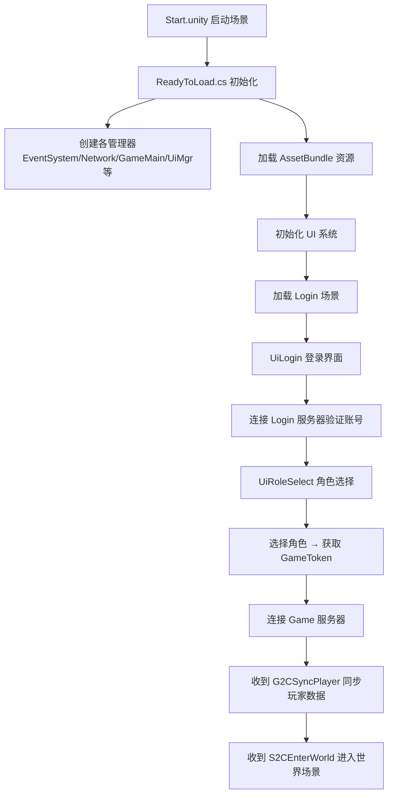
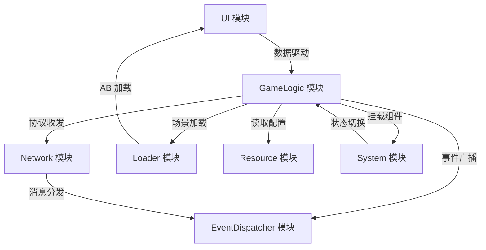

以下是这个 Unity 工程各目录的功能说明：

---

## 工程顶层目录

| 目录 | 说明 |
|------|------|
| `Assets/` | Unity 工程的核心资源目录，包含所有代码、场景、插件等 |
| `Library/` | Unity 自动生成的缓存目录（编译产物、资源数据库等），不需要版本控制 |
| `Logs/` | Unity Editor 运行日志 |
| `Packages/` | Unity Package Manager 的包配置（manifest.json 等） |
| `ProjectSettings/` | 项目全局设置（输入、物理、画质、标签等） |
| `UserSettings/` | 用户个人编辑器设置（布局等），不需要版本控制 |

---

## Assets 子目录

| 目录 | 说明 |
|------|------|
| `Assets/Plugins/` | 第三方插件库（`Google.Protobuf.dll` 用于网络协议序列化，`LitJson.dll` 用于 JSON 解析） |
| `Assets/Resources/` | Unity 内置资源加载目录（存放 `BillingMode.json` 等配置） |
| `Assets/Scenes/` | 场景文件（`Start.unity` 启动场景、`Loader.unity` 加载过渡场景） |
| `Assets/Scripts/` | 所有 C# 游戏逻辑代码 |

---

## Scripts 子目录（核心代码结构）

| 目录 | 说明 |
|------|------|
| `Scripts/Common/` | **通用工具类** — 单例基类（`SingletonBehaviour`/`SingletonObject`）、协程引擎、日志系统、状态机模板等 |
| `Scripts/EventDispatcher/` | **事件系统** — `EventDispatcher`（游戏事件分发）和 `MessagePackDispatcher`（网络消息分发） |
| `Scripts/GameLogic/` | **核心游戏逻辑** — 包含： • `GameMain.cs` — 游戏主控制器（初始化、消息处理、场景加载） • `Account.cs` — 账号/角色数据管理 • `Player/` — 玩家角色（外观、状态机：站立/移动） • `World/` — 世界逻辑（手势操作、世界管理） • `Camera/` — 摄像机跟随 |
| `Scripts/Loader/` | **资源加载系统** — 包含： • `AB/` — AssetBundle 管理（加载、缓存、异步请求） • `Op/` — 场景异步加载器（加载进度、加载缓存） |
| `Scripts/Network/` | **网络通信** — `NetworkMgr.cs`（TCP 连接管理、收发包）、`Packet.cs`（数据包结构）、`Message/`（Protobuf 生成的协议代码和消息 ID 定义） |
| `Scripts/Resource/` | **配置表资源** — CSV 配置表解析系统（`CvsAnalysis`）、引用管理基类（`Reference`/`ReferenceMgr`）、`ResourceWorld.cs`（世界/地图配置）、`ResourceAll.cs`（资源总管理入口） |
| `Scripts/System/` | **组件式系统** — `MoveSystem/`（移动组件）、`UpdateSystem/`（角色更新组件） |
| `Scripts/UI/` | **UI 界面** — 包含： • `Base/` — UI 基类、工厂、类型定义 • `Login/` — 登录界面 • `Roles/` — 角色选择/创建界面 • `Load/` — 加载进度条 • `Modal/` — 模态弹窗（提示框/确认框） • `UiMgr.cs` — UI 管理器 |

---

## 整体架构流程

## 模块依赖关系

## 相关文档

| 文档 | 说明 |
|------|------|
| [ui](docs/ui.md) | UI 框架：生命周期状态机、数据驱动更新、工厂模式、各业务界面 |
| [network](docs/network.md) | 网络通信：TCP 连接管理、数据包格式、协议收发、双服务器架构 |
| [event_dispatcher](docs/event_dispatcher.md) | 事件系统：客户端内部事件分发 + 网络协议消息分发的双分发器设计 |
| [game_logic](docs/game_logic.md) | 核心游戏逻辑：主控制器、账号管理、玩家移动、世界同步、相机跟随 |
| [loader](docs/loader.md) | 资源加载：AssetBundle 异步加载队列、依赖管理、LRU 缓存、场景加载状态机 |
| [system](docs/system.md) | 组件式系统：移动组件（NavMesh 寻路）、角色状态更新组件 |
| [resource](docs/resource.md) | 配置表系统：CSV 解析、泛型管理器、世界/地图配置 |